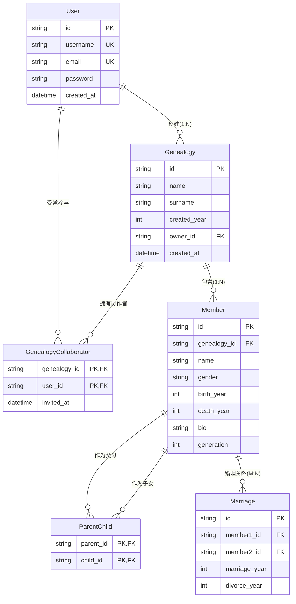
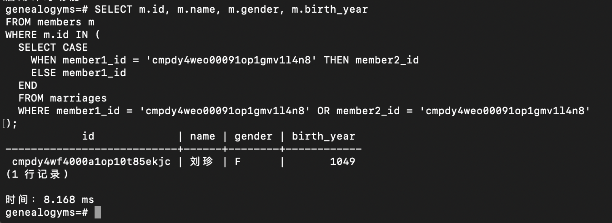
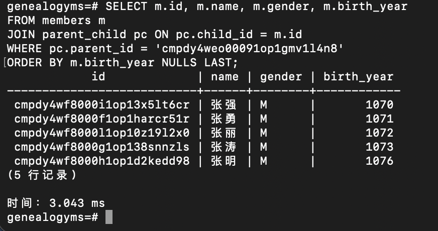
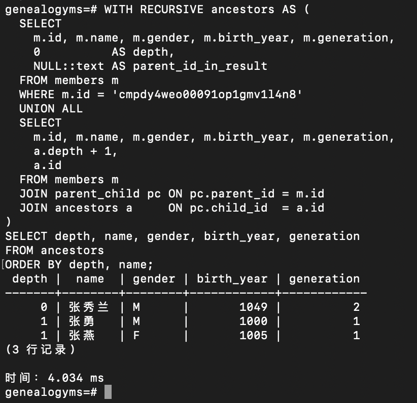
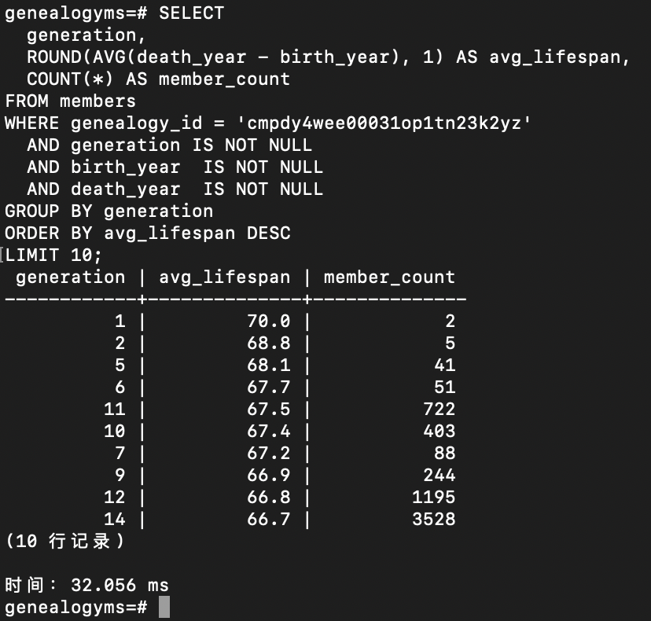
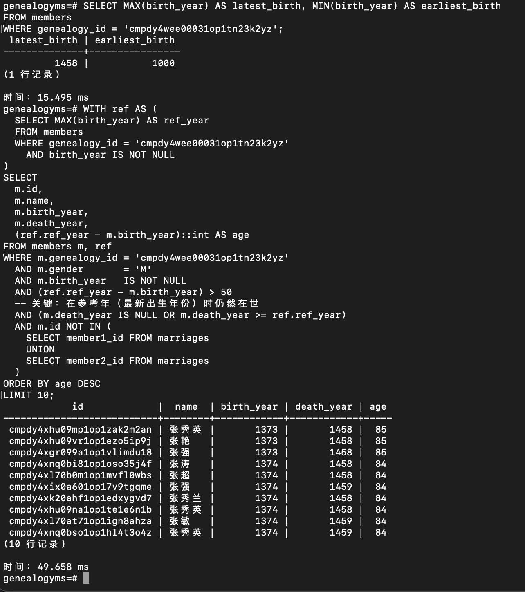
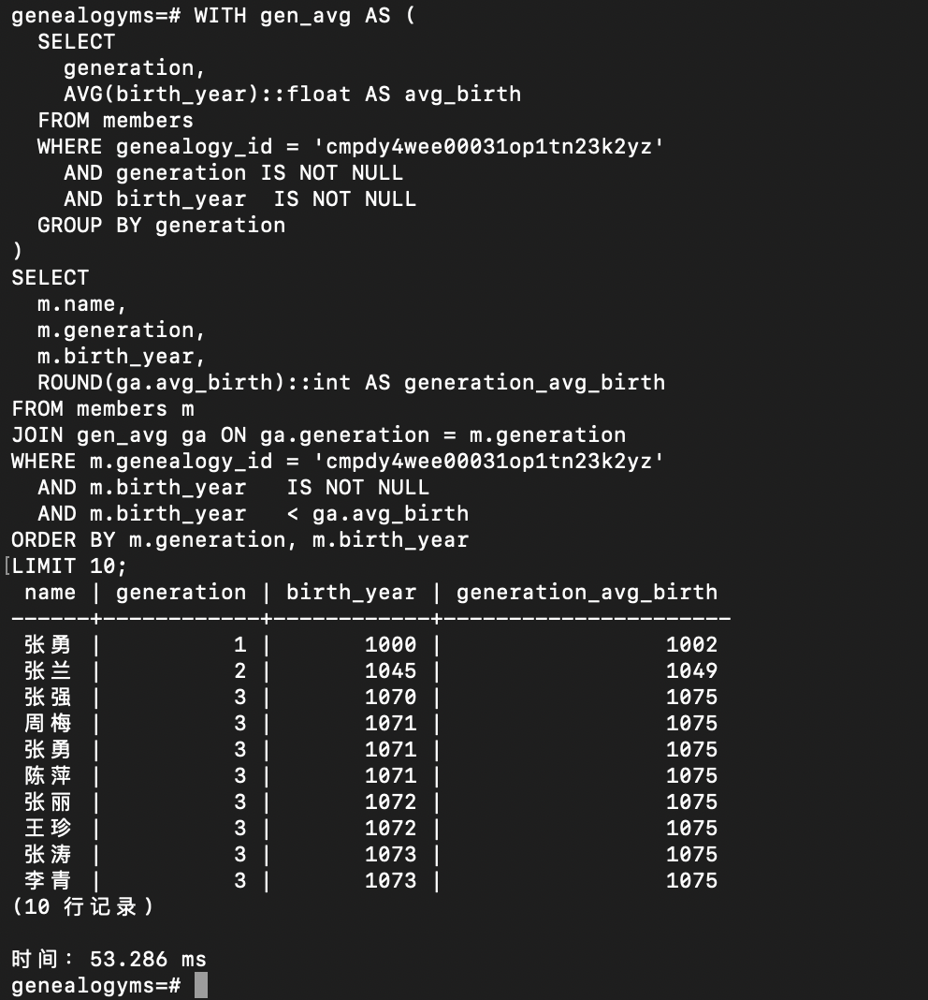
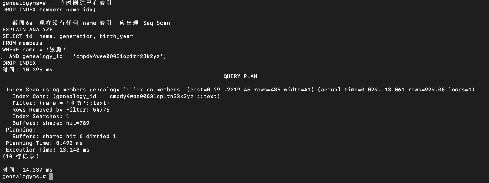
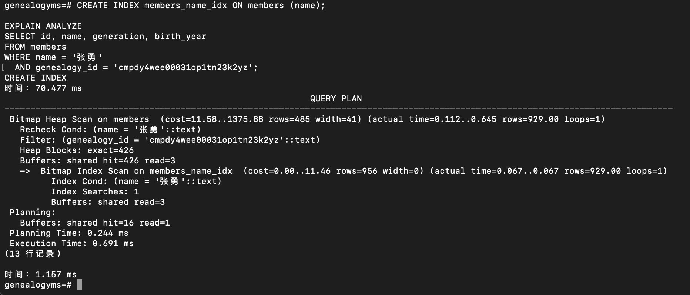
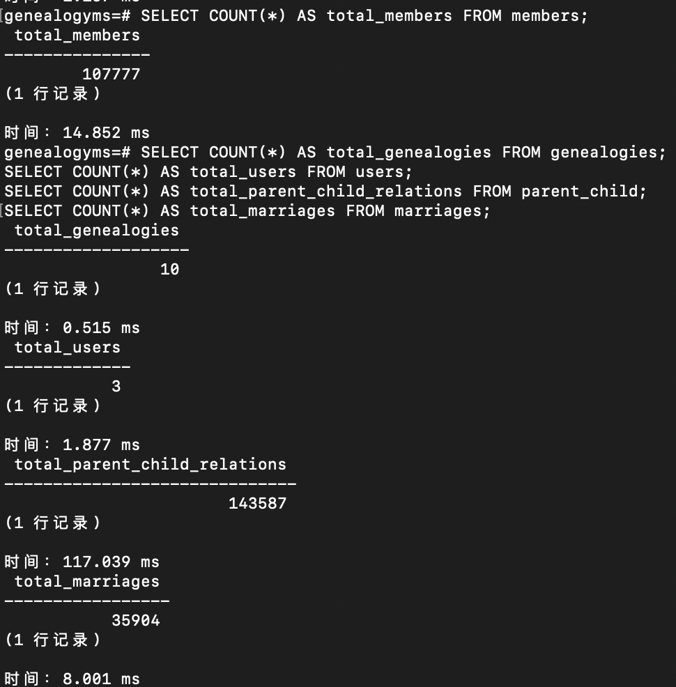

# 数据库课程实验报告
# 寻根溯源族谱管理系统

---

## 一、系统概述

**系统名称：** 寻根溯源族谱管理系统

**功能描述：** 一个支持多用户协作的在线族谱管理系统。用户可创建族谱、管理家族成员（含亲子关系和婚姻关系）、邀请协作者，并提供基于递归 SQL 的祖先溯源、基于图搜索的亲缘路径查询，以及多维度家族统计分析。

**所使用的 RDBMS：** PostgreSQL 18（macOS 安装包版）

**验证版本命令：**
```sql
SELECT version();
-- 输出示例：PostgreSQL 18.x on aarch64-apple-darwin ...
```

---

## 二、E-R 图

### 实体关系图（Mermaid ERD）



### 联系类型汇总

| 联系 | 类型 | 说明 |
|------|------|------|
| User → Genealogy（创建） | 1:N | 一个用户可创建多个族谱 |
| Genealogy ↔ User（协作） | M:N | 通过 GenealogyCollaborator 关联 |
| Genealogy → Member | 1:N | 一个族谱包含多个成员 |
| Member ↔ Member（亲子） | M:N self | 通过 ParentChild 关联，支持双亲记录 |
| Member ↔ Member（婚姻） | M:N self | 通过 Marriage 关联 |

---

## 三、关系模型

```
users(id, username, email, password, created_at)
  PK: id
  UK: username
  UK: email

genealogies(id, name, surname, created_year, owner_id, created_at)
  PK: id
  FK: owner_id → users(id)  ON DELETE CASCADE

genealogy_collaborators(genealogy_id, user_id, invited_at)
  PK: (genealogy_id, user_id)
  FK: genealogy_id → genealogies(id)  ON DELETE CASCADE
  FK: user_id → users(id)  ON DELETE CASCADE

members(id, genealogy_id, name, gender, birth_year, death_year, bio, generation)
  PK: id
  FK: genealogy_id → genealogies(id)  ON DELETE CASCADE
  CHECK: gender IN ('M', 'F')
  CHECK: death_year IS NULL OR death_year > birth_year

parent_child(parent_id, child_id)
  PK: (parent_id, child_id)
  FK: parent_id → members(id)  ON DELETE CASCADE
  FK: child_id → members(id)   ON DELETE CASCADE

marriages(id, member1_id, member2_id, marriage_year, divorce_year)
  PK: id
  FK: member1_id → members(id)  ON DELETE CASCADE
  FK: member2_id → members(id)  ON DELETE CASCADE
  CHECK: divorce_year IS NULL OR divorce_year >= marriage_year
```

---

## 四、3NF 分析说明

### 第一范式（1NF）✅

**要求：** 所有属性均为原子值，无重复组。

**分析：**
- 每列只存储单一值（字符串、整数、日期等基本类型）
- 多值关系（亲子、婚姻、协作者）均通过独立关联表拆分，主表中无数组列
- 所有表满足 1NF

### 第二范式（2NF）✅

**要求：** 满足 1NF，且非主属性完全函数依赖于主键（消除部分依赖）。

**分析：**

`genealogy_collaborators(genealogy_id, user_id, invited_at)`：
- 复合主键 `(genealogy_id, user_id)`
- `invited_at` 依赖完整复合主键（表示这对协作关系的邀请时间），无部分依赖
- ✅ 满足 2NF

`parent_child(parent_id, child_id)`：
- 复合主键，无非主属性，平凡满足 2NF ✅

其余表均为单列主键（CUID 字符串），不存在部分依赖问题，自动满足 2NF。

### 第三范式（3NF）✅

**要求：** 满足 2NF，无传递依赖（非主属性不依赖另一非主属性）。

**逐表分析：**

**`users`：**
- `id → username, email, password, created_at`
- 所有属性直接依赖 `id`，无传递依赖 ✅

**`genealogies`：**
- `id → name, surname, created_year, owner_id, created_at`
- `owner_id` 是外键引用，`name`/`surname` 等属性均直接依赖 `id`，不经由 `owner_id` 推导 ✅

**`members`：**
- `id → genealogy_id, name, gender, birth_year, death_year, bio, generation`
- 关键验证：`generation` 是否依赖 `genealogy_id`？
  - 否。`generation` 描述成员在族谱中的辈分，属于成员的内在属性，直接由 `id` 确定
  - 若辈分由族谱统一规定，则应单独建表；本设计中辈分为成员自身属性，满足 3NF ✅

**`parent_child`、`marriages`：**
- 关联表，非主属性（`invited_at`、`marriage_year` 等）均直接依赖主键 ✅

**结论：所有关系模式均满足 3NF（同时满足 BCNF）。**

### BCNF 补充说明

`members` 中若存在 `name → generation` 的函数依赖（同名必须同辈），会破坏 BCNF。本设计允许同名异辈（任务书明确指出此情况），`name` 不构成候选键，故不产生违反 BCNF 的函数依赖，满足 BCNF。

---

## 五、索引与约束说明

### 5.1 主键与唯一约束

| 表 | 主键 | 唯一约束 |
|----|------|---------|
| `users` | `id` | `username`, `email` |
| `genealogies` | `id` | — |
| `genealogy_collaborators` | `(genealogy_id, user_id)` 复合主键 | — |
| `members` | `id` | — |
| `parent_child` | `(parent_id, child_id)` 复合主键 | — |
| `marriages` | `id` | — |

### 5.2 外键约束（均为 CASCADE 级联删除）

| 从表 | 外键字段 | 引用 |
|------|---------|------|
| `genealogies` | `owner_id` | `users(id)` |
| `genealogy_collaborators` | `genealogy_id` | `genealogies(id)` |
| `genealogy_collaborators` | `user_id` | `users(id)` |
| `members` | `genealogy_id` | `genealogies(id)` |
| `parent_child` | `parent_id` | `members(id)` |
| `parent_child` | `child_id` | `members(id)` |
| `marriages` | `member1_id` | `members(id)` |
| `marriages` | `member2_id` | `members(id)` |

级联删除语义：删除用户时，其所有族谱及族谱内所有成员、关系均自动删除。

### 5.3 CHECK 约束

| 表 | 约束 | 含义 |
|----|------|------|
| `members` | `gender IN ('M', 'F')` | 性别只能是男（M）或女（F） |
| `members` | `death_year IS NULL OR death_year > birth_year` | 逝世年份必须晚于出生年份 |
| `marriages` | `divorce_year IS NULL OR divorce_year >= marriage_year` | 离婚年份不早于结婚年份 |

> 「父母出生年份早于子女」的约束在应用层（API 接口）验证，未在数据库层添加 CHECK，以避免递归约束检查的开销。

### 5.4 索引设计

**（一）B-Tree 索引（已在 Prisma schema 中定义，迁移时自动创建）**

```sql
-- 按族谱查询成员（最频繁的查询）
CREATE INDEX idx_members_genealogy_id ON members (genealogy_id);

-- 按姓名查找（精确查找）
CREATE INDEX idx_members_name ON members (name);

-- 亲子关系查询（递归 CTE 每轮都要用）
CREATE INDEX idx_parent_child_parent_id ON parent_child (parent_id);
CREATE INDEX idx_parent_child_child_id  ON parent_child (child_id);

-- 婚姻关系查询
CREATE INDEX idx_marriages_member1_id ON marriages (member1_id);
CREATE INDEX idx_marriages_member2_id ON marriages (member2_id);
```

**（二）GIN + pg_trgm 索引（模糊搜索专用，需手动创建）**

```sql
-- 启用 pg_trgm 扩展
CREATE EXTENSION IF NOT EXISTS pg_trgm;

-- 姓名模糊查询索引（支持 ILIKE '%关键词%'）
CREATE INDEX idx_members_name_trgm ON members USING GIN (name gin_trgm_ops);
```

原理：Trigram 将字符串拆分为所有三字符组合，GIN 建立倒排索引，使通配符在开头的模糊查询也能走索引而非全表扫描。

### 5.5 索引性能对比

对 `members.name` 字段的精确查找（`WHERE name = '张勇'`，含 `genealogy_id` 过滤，数据集约 55,700 条成员）进行有无索引的实测对比：

| 场景 | 扫描方式 | Execution Time | 扫描行数 |
|------|---------|---------------|---------|
| 无 `members_name_idx` 索引 | `Index Scan using members_genealogy_id_idx`（回退到另一索引后逐行过滤） | **13.148 ms** | 54,775 行（过滤后保留 929 行） |
| 有 `members_name_idx` 索引 | `Bitmap Index Scan on members_name_idx` | **0.691 ms** | 直接命中 929 行 |
| 加速比 | — | **约 19 倍** | — |

**说明：** 无 `name` 索引时，优化器退而求其次，用 `genealogy_id` 索引先取出该族谱全部 55,700 条记录，再对每条逐行比对 `name = '张勇'`（`Rows Removed by Filter: 54775`），造成大量无效扫描。有 `name` 索引后，优化器改用 Bitmap Index Scan 直接定位所有同名成员，再回表取行，效率大幅提升。

> 详细的 EXPLAIN ANALYZE 截图见本报告第八节。

---

## 六、数据生成方法

### 6.1 生成方式

本项目采用**自编工具自动生成**，不使用手工插入。工具源码见：`SUBMISSION/工具源码/seed.ts`。

### 6.2 工具说明

**运行命令：**
```bash
npm run db:seed
# 等价于：npx tsx scripts/seed.ts
```

**生成规模：**
- 3 个测试用户账号
- 10 个族谱（其中 1 个大型族谱含 50,000+ 成员）
- 总计 100,000+ 成员
- 每个族谱至少 30 代传承
- 每个成员与其他成员存在至少一种亲缘关系

**生成算法（层级扩展法）：**

```
第1代：创建始祖夫妇（insert 2条成员 + 1条婚姻记录）
         ↓
第N代（N = 2, 3, 4, ...）：
  - 遍历上一代所有父母对
  - 每对父母随机生育 2-5 个孩子（随机性别）
  - 批量 INSERT 孩子记录（每批 500 条）
  - 批量 INSERT 亲子关系（parent_child）
  - 为男性成员创建配偶（从其他姓氏随机生成女性成员）
  - 批量 INSERT 婚姻关系（marriages）
  - 重复直到总人数 ≥ 目标规模 且 代数 ≥ 最小代数
```

**出生年份规则：**
- 第1代：约公元 1000 年
- 每代间隔约 25 年（±5年随机偏差）
- 寿命：出生年份 + 50~85年随机值

**同时生成 CSV 文件：**
工具运行结束后会生成 `scripts/members_export.csv`，可通过 PostgreSQL `COPY` 命令批量导入（演示 COPY 功能）。

### 6.3 使用 COPY 批量导入演示

```sql
-- 在 psql 中执行（注意使用 \COPY，适合本地文件）
\COPY members (id, genealogy_id, name, gender, birth_year, death_year, bio, generation)
FROM '/path/to/GenealogyMS/scripts/members_export.csv'
CSV HEADER;
```

---

## 七、所有 SQL 语句

> 注：以下 SQL 中的占位符（如 `'TARGET_ID'`、`'GENEALOGY_ID'`、`'ANCESTOR_ID'`）在实际执行时需替换为真实 ID。ID 可从系统的「成员管理」页面复制。

---

### SQL-1：查询指定成员的配偶及所有子女

```sql
-- 查询配偶（婚姻关系双向处理）
SELECT m.id, m.name, m.gender, m.birth_year
FROM members m
WHERE m.id IN (
  SELECT CASE
    WHEN member1_id = 'TARGET_ID' THEN member2_id
    ELSE member1_id
  END
  FROM marriages
  WHERE member1_id = 'TARGET_ID' OR member2_id = 'TARGET_ID'
);

-- 查询子女（通过亲子关系表）
SELECT m.id, m.name, m.gender, m.birth_year
FROM members m
JOIN parent_child pc ON pc.child_id = m.id
WHERE pc.parent_id = 'TARGET_ID'
ORDER BY m.birth_year NULLS LAST;
```

---

### SQL-2：递归祖先查询（WITH RECURSIVE）

```sql
WITH RECURSIVE ancestors AS (
  -- 基础情形：起始成员（深度0，即查询目标本人）
  SELECT
    m.id,
    m.name,
    m.gender,
    m.birth_year,
    m.death_year,
    m.generation,
    0            AS depth,
    NULL::text   AS parent_id_in_result
  FROM members m
  WHERE m.id = 'TARGET_ID'

  UNION ALL

  -- 递归步骤：向上一层找父母
  SELECT
    m.id,
    m.name,
    m.gender,
    m.birth_year,
    m.death_year,
    m.generation,
    a.depth + 1  AS depth,
    a.id         AS parent_id_in_result
  FROM members m
  JOIN parent_child pc ON pc.parent_id = m.id   -- 找父母
  JOIN ancestors a     ON pc.child_id  = a.id   -- 连接上一轮结果
)
SELECT * FROM ancestors ORDER BY depth, name;
```

---

### SQL-3：统计各辈分平均寿命（GROUP BY + AVG）

```sql
SELECT
  generation,
  ROUND(AVG(death_year - birth_year), 1) AS avg_lifespan,
  COUNT(*)                                AS member_count
FROM members
WHERE genealogy_id = 'GENEALOGY_ID'
  AND generation IS NOT NULL
  AND birth_year  IS NOT NULL
  AND death_year  IS NOT NULL
GROUP BY generation
ORDER BY avg_lifespan DESC
LIMIT 10;
```

---

### SQL-4：查询相对年龄超过50岁且无配偶的男性成员

> **说明：** 数据库中成员出生年份从公元 1000 年起计（历史数据），若用当前系统年份（2026年）计算年龄会得到数百年的荒谬结果。本查询改用**族谱内最大出生年份**作为参考基准年，计算各成员相对于「最新一代」的年龄差，语义为：比族谱中最年轻一代年长超过 50 岁且从未婚配的男性。

```sql
WITH ref AS (
  -- 取该族谱内最大出生年份作为时间参考点
  SELECT MAX(birth_year) AS ref_year
  FROM members
  WHERE genealogy_id = 'GENEALOGY_ID'
    AND birth_year IS NOT NULL
)
SELECT
  m.id,
  m.name,
  m.birth_year,
  m.death_year,
  (ref.ref_year - m.birth_year)::int AS age
FROM members m, ref
WHERE m.genealogy_id = 'GENEALOGY_ID'
  AND m.gender       = 'M'
  AND m.birth_year   IS NOT NULL
  AND (ref.ref_year - m.birth_year) > 50
  -- 在参考时间点时仍然在世（未死亡或死亡年份不早于参考年）
  AND (m.death_year IS NULL OR m.death_year >= ref.ref_year)
  AND m.id NOT IN (
    SELECT member1_id FROM marriages
    UNION
    SELECT member2_id FROM marriages
  )
ORDER BY age DESC
LIMIT 20;
```

---

### SQL-5：找出出生年份早于本辈分平均出生年的成员（CTE）

```sql
WITH gen_avg AS (
  SELECT
    generation,
    AVG(birth_year)::float AS avg_birth
  FROM members
  WHERE genealogy_id = 'GENEALOGY_ID'
    AND generation   IS NOT NULL
    AND birth_year   IS NOT NULL
  GROUP BY generation
)
SELECT
  m.id,
  m.name,
  m.generation,
  m.birth_year,
  ROUND(ga.avg_birth)::int AS generation_avg_birth
FROM members m
JOIN gen_avg ga ON ga.generation = m.generation
WHERE m.genealogy_id = 'GENEALOGY_ID'
  AND m.birth_year   IS NOT NULL
  AND m.birth_year   < ga.avg_birth
ORDER BY m.generation, m.birth_year
LIMIT 20;
```

---

### SQL-6：索引性能对比（EXPLAIN ANALYZE）

> 对 `members.name` 精确查找进行有无 B-Tree 索引的执行计划对比。

```sql
-- 第一步：无索引版本（确保 idx_members_name_btree 不存在）
DROP INDEX IF EXISTS idx_members_name_btree;

EXPLAIN ANALYZE
SELECT id, name, generation, birth_year
FROM members
WHERE name = '张勇'
  AND genealogy_id = 'GENEALOGY_ID';
```

```sql
-- 第二步：创建索引后重新测试
CREATE INDEX idx_members_name_btree ON members (name);

EXPLAIN ANALYZE
SELECT id, name, generation, birth_year
FROM members
WHERE name = '张勇'
  AND genealogy_id = 'GENEALOGY_ID';

-- 第三步：删除临时索引（恢复原状）
DROP INDEX idx_members_name_btree;
```

---

## 八、SQL 执行结果截图

> **操作说明：** 请参考 `SQL截图操作指南.md` 完成截图，将截图图片文件放入本文件夹，并将下方占位文字替换为图片引用。

### 截图1：SQL-1 配偶和子女查询结果





查询结果包含成员 `id`、`name`、`gender`、`birth_year`、`death_year` 字段，以及通过关联查询得到的配偶信息和子女列表。

### 截图2：SQL-2 递归祖先查询结果



查询结果包含 `depth` 字段（从目标成员向上追溯的层数）及各层祖先的 `name`、`birth_year`，覆盖 3 层以上。递归 CTE 通过逐层展开 `parent_child` 关系实现。

### 截图3：SQL-3 各辈分平均寿命统计结果



查询结果按 `avg_lifespan` 降序排列，显示各 `generation` 辈分的平均寿命（年）和 `member_count` 人数统计，仅统计有完整出生/死亡年份记录的成员。

### 截图4：SQL-4 相对年龄超50且无配偶男性查询结果



查询结果显示 `id`、`name`、`birth_year`、`death_year`、`age` 列，按 `age` 降序排列。`age` 为相对于族谱最新出生年份（1458年）的年龄差，均大于 50；所有结果行在参考年时仍在世且未出现在 `marriages` 表中。

### 截图5：SQL-5 早于本代平均出生年的成员查询结果



查询结果包含 `name`、`generation`、`birth_year`、`generation_avg_birth` 四列，每行 `birth_year` 均严格小于其所在辈分的平均出生年份，通过 CTE 先计算各辈分均值再 JOIN 过滤实现。

### 截图6a：SQL-6 无索引时的 EXPLAIN ANALYZE 结果



**执行计划分析（实测结果）：**

```
Index Scan using members_genealogy_id_idx on members
  Index Cond: (genealogy_id = '...')         -- 先用族谱ID索引缩小范围
  Filter: (name = '张勇')                   -- 再对每行逐一过滤姓名
  Rows Removed by Filter: 54775             -- 扫描了 54,775 行后才筛出目标
  Execution Time: 13.148 ms
```

无 `name` 索引时，优化器退而求其次，用 `genealogy_id` 索引取出该族谱全部约 55,700 条记录，再逐行比对姓名，造成大量无效扫描（54,775 行被过滤丢弃），执行耗时 **13.148 ms**。

### 截图6b：SQL-6 有索引时的 EXPLAIN ANALYZE 结果



**执行计划分析（实测结果）：**

```
Bitmap Heap Scan on members
  Recheck Cond: (name = '张勇')
  Filter: (genealogy_id = '...')
  Heap Blocks: exact=426
  ->  Bitmap Index Scan on members_name_idx   -- 直接走 name 索引
        Index Cond: (name = '张勇')
        rows=929                              -- 精准命中 929 行
  Execution Time: 0.691 ms
```

创建 `members_name_idx`（B-Tree 索引）后，优化器改用 Bitmap Index Scan 直接在索引树中定位所有名为"张勇"的记录（929 行），无需扫描其余数万条数据，执行耗时降至 **0.691 ms**，**提速约 19 倍**。

### 截图7：数据库总规模（成员总数验证）



显示 `SELECT COUNT(*) FROM members` 及各表记录数统计，`total_members` 结果应 ≥ 100,000，证明数据规模满足实验要求。

---

## 九、个人工作说明

### 开发者甲（数据库与后端）

**主要工作内容：**

1. **数据库建模**：根据业务需求设计 6 张表的结构，绘制 ER 图，编写 `prisma/schema.prisma` 定义所有模型、字段类型、外键关系和约束条件

2. **数据库迁移**：配置 `prisma.config.ts`，执行 `npm run db:migrate` 在 PostgreSQL 中创建所有表结构和索引

3. **认证系统**：配置 NextAuth.js（`lib/auth.ts`），实现基于 bcrypt 哈希的密码验证和 JWT 会话管理；编写路由守卫（`proxy.ts`）保护所有需要登录的页面

4. **后端 API 接口**：编写 `app/api/` 下全部 `route.ts` 文件，实现族谱 CRUD、成员 CRUD、协作者管理、统计分析等接口，包含权限验证逻辑

5. **复杂 SQL 查询**：编写 `lib/queries/ancestors.ts`（递归 CTE 祖先/后代查询）、`lib/queries/relationship.ts`（亲缘邻接关系 SQL + BFS 路径算法）、`lib/queries/statistics.ts`（5 个统计分析查询）

6. **数据生成工具**：编写 `scripts/seed.ts`（层级扩展算法批量生成 10 万+成员数据）和 `scripts/export-branch.ts`（递归导出成员后代 CSV，演示 COPY 功能）

7. **性能优化**：设计索引方案（B-Tree 外键索引 + GIN+Trigram 模糊搜索索引），编写 EXPLAIN ANALYZE 性能对比实验

### 开发者乙（前端与可视化）

**主要工作内容：**

1. **UI 组件库**：手工实现 Button、Input、Card、Select、Textarea、Badge、Modal 等基础 UI 组件（`components/ui/`），使用 Tailwind CSS 样式

2. **侧边导航栏**：实现带路由高亮的侧边栏（`components/ui/sidebar.tsx`），支持用户信息显示和退出登录

3. **认证页面**：编写登录页（`app/(auth)/login/page.tsx`）和注册页（`app/(auth)/register/page.tsx`），实现表单验证和错误提示

4. **族谱管理页面**：编写族谱列表页、创建页、详情页（`app/(main)/genealogies/`），实现增删查界面

5. **成员管理页面**：编写成员管理页（`members/page.tsx`），包含分页表格、模糊搜索、添加/编辑/删除操作，以及成员 ID 显示和复制功能（供祖先查询使用）

6. **成员表单组件**：编写可复用的成员表单（`components/forms/member-form.tsx`），支持新建和编辑两种模式，实现父母 ID 标签式输入

7. **树形可视化**：集成 Apache ECharts，编写树形图组件（`components/tree/echarts-tree.tsx`）和数据转换函数（`lib/tree-builder.ts`），将递归 CTE 结果渲染为交互式树状图

8. **祖先查询页面**：编写 `ancestor/page.tsx`，展示祖先树图和按层级缩进的文字列表

9. **亲缘路径可视化**：编写 `relation/page.tsx`，将 BFS 路径结果渲染为圆形节点路径图
