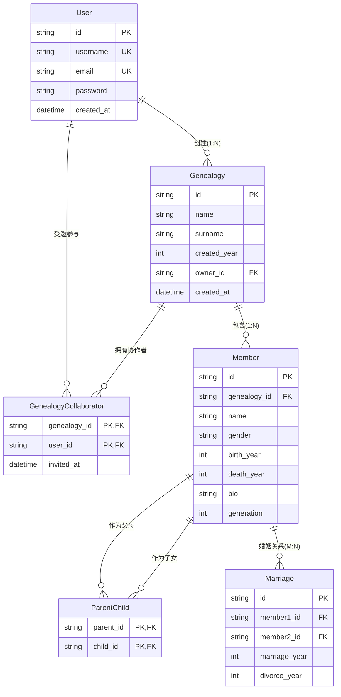

# ER 图 — 寻根溯源族谱管理系统

## 实体关系图（Mermaid ERD）

## 实体说明

### User（用户）
- 系统账号实体，支持注册制
- 可以创建多个族谱（1:N 关系）
- 可以被邀请为其他族谱的协作者

### Genealogy（族谱）
- 核心管理单元，对应一个家族
- `owner_id` 指向创建者（强外键）
- 与 `User` 通过 `GenealogyCollaborator` 实现 M:N 协作关系

### GenealogyCollaborator（族谱协作者，关联表）
- 解决 Genealogy ↔ User 的 M:N 关系
- 复合主键 `(genealogy_id, user_id)`
- 记录邀请时间

### Member（族谱成员）
- 核心数据实体，`genealogy_id` 确保成员归属明确
- `generation` 存储辈分整数，便于统计
- `gender` 使用 'M'/'F' 枚举值

### ParentChild（亲子关系，自引用关联表）
- 解决 Member ↔ Member 的亲子 M:N 自引用
- 复合主键 `(parent_id, child_id)` 防止重复
- 支持双亲（父亲 + 母亲）分别记录

### Marriage（婚姻关系，自引用关联表）
- 解决 Member ↔ Member 的婚姻 M:N 自引用
- 记录结婚年份和离婚年份（可选）

## 联系类型汇总

| 联系 | 类型 | 说明 |
|------|------|------|
| User → Genealogy（创建） | 1:N | 一个用户可创建多个族谱 |
| Genealogy ↔ User（协作） | M:N | 通过 GenealogyCollaborator 关联 |
| Genealogy → Member | 1:N | 一个族谱包含多个成员 |
| Member ↔ Member（亲子） | M:N self | 通过 ParentChild 关联，支持双亲 |
| Member ↔ Member（婚姻） | M:N self | 通过 Marriage 关联 |
